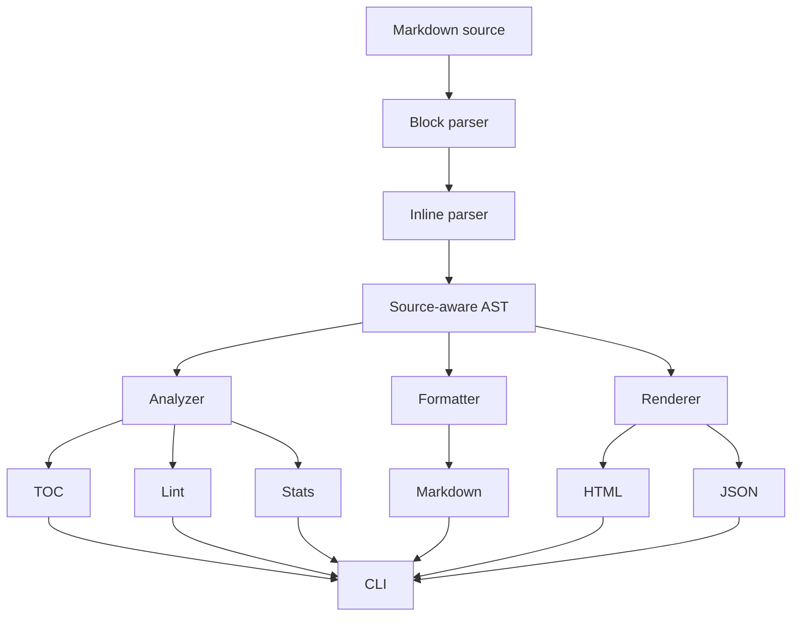

# Architecture

CraterMark uses a source-aware AST as the boundary between parsing and every downstream
feature. A renderer never reads Markdown directly, and an analyzer never depends on
parser internals.

## Data flow

## Packages

### `src/ast`

Defines `Document`, `Block`, `Inline`, `ListItem`, and `Position`. Public enum
constructors make the AST usable by third-party packages. `inline_plain_text` and
`slugify` are shared semantic helpers.

### `src/parser`

The block parser operates line-by-line and recognizes headings, fenced code, rules,
quotes, and lists before falling back to paragraphs. Block text is delegated to the
inline parser, which recognizes strong text, emphasis, code, links, and images.

The parser normalizes CRLF and CR line endings to LF. Positions are one-based and use
a half-open end column.

### `src/renderer`

Contains independent HTML, JSON, and Markdown renderers. HTML output escapes text and
attributes and replaces script-like URLs with `#`. JSON is stable and includes every
node's position. Markdown output is canonical and powers formatting.

### `src/analyzer`

Traverses the AST without reparsing source. It exposes TOC entries, statistics, and a
lint registry. The five initial lint checks return structured `LintIssue` values before
the CLI decides how to display them.

### `src/formatter`

A deliberately thin transformation boundary. Today it emits canonical Markdown from
the AST; future transformations can be inserted here without changing the parser or
CLI.

### `cmd/cratermark`

Owns file I/O, arguments, and human-readable output. It does no Markdown processing
itself. Argument discovery accommodates both native executables and the JavaScript
backend's two launcher arguments.

## Extension points

- Add a syntax feature vertically: AST node, parser, all renderers, then tests.
- Add an analyzer by walking `Document.children`; do not inspect source with regexes.
- Add a renderer without changing parser behavior.
- Add lint metadata to `lint_rules()` and return structured issues from `lint()`.

## Deliberate limits

This parser is not a full CommonMark implementation. Nested lists, lazy block-quote
continuations, reference links, raw HTML blocks, Setext headings, and complex escaping
are deferred. Keeping these boundaries explicit prevents subtle partial compatibility
from becoming an undocumented contract.
